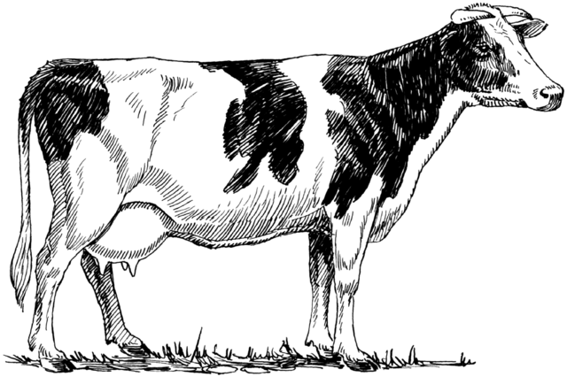

# cowpen

CLI for publishing immutable NPM packages/NodeJS modules



## What is this?

This is my attempt to solve some issues with NPM by using an immutable filesystem called IPFS. IPFS guarantees that whatever you downloads, will match with the hash you use to download that thing. cowpen is applying this to NodeJS modules.

It's mostly about being able to store and retrieve packages in a safe way that allows you to have reproducible builds, at all times.

## Problems cowpen is solving

* Don't reinvent everything NPM already solved (don't rewrite the entire CLI)
* Packages can never just disappears. If you `pin` a package, it'll be there until there is no seeds (similar to Bittorrent).
* New versions won't change your application, ever.
* No centralization, which means no one will force you to remove a package.
* Don't care about politics, just about publishing and reusing other peoples code.
* Simply how to deal with NodeJS modules in a better way.

## Problems cowpen doesn't care about

* Copyright (If you seed a package, you're responsible for the downfall of seeding it)
* npm scripts "vulnerability" (Downloading code and executing it is literally a package managers job, we're not gonna change that)
* Politics (We're never gonna delete your package, because we can't)

## Requirements

* NodeJS version 4 or higher
* NPM version 3 or higher
* IPFS version 0.3.11 or higher

cowpen might work on earlier releases of these programs but it has not been tested so we cannot guarantee anything.
Please let us know if it work/doesn't work for you.

## Installation & Setup

* `ipfs daemon --init --mount`
* Wait until you see `Daemon is ready` in output
* `npm install -g cowpen@/ipfs/IPFS-HASH-FOR-COWPEN`

Wait, what's the weird @/ipfs/... thing? That's the IPFS part of cowpen.

When NPM sees a filepath as the version argument, NPM tries to "download" the module from the filesystem instead.

And in the first step, you run IPFS with the `--mount` argument, IPFS mounts /ipfs and /ipns to serve content from IPFS.

So with a little bit of magic, we have installed cowpen with IPFS. Simple huh?

## How do I install modules with this?

You just use NPM like you're used to, but without shrinkwrap and versions being IPFS hashes instead of semvers.

You want to install a package and save it in your local project?
Find out the hash (cowpen will include search in the future) and install it!

```
npm install --save lodash@/ipfs/Qmec32NqcZCh83t9QhrfVFnHq9eHSNr389y8z6mSvBabDp
```

Now it's installed, and with the hash we make sure that you always have the same version installed.

You want to install all dependencies in a project that is using cowpen?

```
npm install
```

It couldn't get any easier than this.

## How do I publish a module?

Simple! Just do: (while being in the directory of the package you want to publish)

```
cowpen publish
```

And cowpen will return you the path you can use for installing your package.

If you're clever, you include this hash wherever you are doing releases, like a mailing list, Github Release or the Git tag when creating it.

That way, people who want to use your package via cowpen, can easily find it.

## How do I find new packages?

Well, here is the tricky part. We haven't quite figured out searching yet, but the idea
is for every user to run their own ipfs daemon, with a keybase account for verifying the publishing...

But right now, we don't really have a solution for this. Best would be for you to simply
include the hash wherever you do releases currently.

## Notes & Ideas

### Trust

If package A publishes version 1 as ABDEF and package B publishes version 1 as ABDEF, what happens?

A package version has to published by the same peer ID as the first version was published as.

So in this case, publishing by package B would be blocked from cowpen. But what if he simple inserts the hash manually?

Rejected!

## Name

What does Cowpen mean? Well, I don't know. The name is taken from a street in Bahamas.

## Support / Help

If you have any questions, open a Github issue here:
[github.com/VictorBjelkholm/cowpen/issues/new](https://github.com/VictorBjelkholm/cowpen/issues/new)

or feel free to contact me on Twitter here:
[@VictorBjelkholm](https://twitter.com/VictorBjelkholm)

## License

The MIT License (MIT)

Copyright (c) 2016 Victor Bjelkholm

Permission is hereby granted, free of charge, to any person obtaining a copy of this software and associated documentation files (the "Software"), to deal in the Software without restriction, including without limitation the rights to use, copy, modify, merge, publish, distribute, sublicense, and/or sell copies of the Software, and to permit persons to whom the Software is furnished to do so, subject to the following conditions:

The above copyright notice and this permission notice shall be included in all copies or substantial portions of the Software.

THE SOFTWARE IS PROVIDED "AS IS", WITHOUT WARRANTY OF ANY KIND, EXPRESS OR IMPLIED, INCLUDING BUT NOT LIMITED TO THE WARRANTIES OF MERCHANTABILITY, FITNESS FOR A PARTICULAR PURPOSE AND NONINFRINGEMENT. IN NO EVENT SHALL THE AUTHORS OR COPYRIGHT HOLDERS BE LIABLE FOR ANY CLAIM, DAMAGES OR OTHER LIABILITY, WHETHER IN AN ACTION OF CONTRACT, TORT OR OTHERWISE, ARISING FROM, OUT OF OR IN CONNECTION WITH THE SOFTWARE OR THE USE OR OTHER DEALINGS IN THE SOFTWARE.
